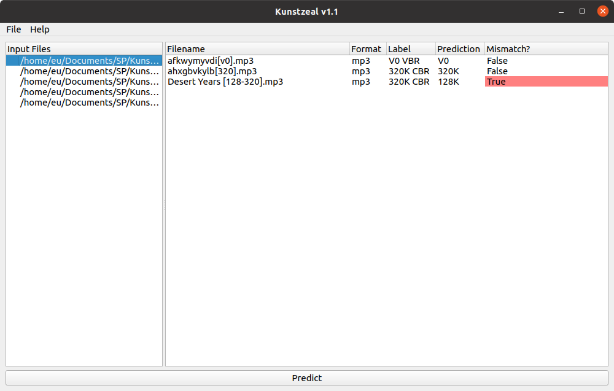

# Kunstzeal

## About
Kunstzeal is a spectrogram analyzer written in Python. It uses librosa for processing audio and Pyside6 for the GUI. Kunstzeal uses a pre-trained CNN made using PyTorch to classify audio files in one of the following labels:
- FLAC
- V0
- 320K
- 192K
- 128K

The program generates a spectrogram and performs spectrogram analysis by itself. Once finished, it will display a judgement on whether the predicted label matches the audio file's metadata. Currently, the model is able to correctly predict 97% of the time.

Specifications for the CNN used, build instructions, etc. can be [found in the wiki][wiki].

## Usage
The latest release can be [downloaded here][latest-release]. Make sure to download the `.zip` that corresponds to your system.
- Add audio files by dragging and dropping `.mp3` or `.flac` files into the program or using the file picker.
- Press the _predict_ button to initiate automated labeling.
- Right-click an added audio file to view the context menu.

**Warning**: Due to the nature of generating Spectrograms, the program may take awhile to predict on older CPUs. It may even crash without enough RAM.

##  License
This software is licensed under the [GNU General Public License v3](LICENSE).

[wiki]: https://github.com/jpcarreon/Kunstzeal/wiki
[latest-release]: https://github.com/jpcarreon/Kunstzeal/releases/latest